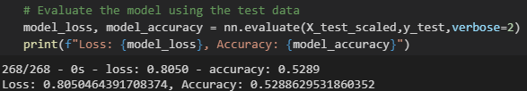
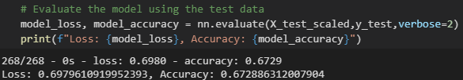

# Neural_Network_Charity_Analysis

## Overview of Analysis

Put my skills to work to help a foundation predict where to make investments.

With my knowledge of machine learning and neural networks, use the features in the provided dataset to help Beks create a binary classifier that is capable of predicting whether applicants will be successful if funded by Alphabet Soup.

From Alphabet Soup’s business team, Beks received a CSV containing more than 34,000 organizations that have received funding from Alphabet Soup over the years. Within this dataset are a number of columns that capture metadata about each organization, such as the following:

## Results

### Data Preprocessing

- The IS_SUCCESSFUL column of the original dataset is the target of the model
- The following are features of the model: Application Type, Afficiation Classification, Use Case, Organization, Status, Income Amount, Special Considerations, and Ask Amount
- The EIN and Name columns aren't targets or features so were removed from the input data

### Compiling, Training, and Evaluating the Model

Initially tried with two hidden layers with 80 and 30 neurons, both using the relu activation function. This gave me an accuarcy of 52.8% which didn't acheive the target model performance:

Then I tried reducing the buckets as well as removing columns that were almost completely one variable to hopefully reduce the noise and re-ran with the same model. This gave me an accuracy of 67.3%:

I tried another by changing the activation to tanh which actually reduced the accuracy to 56.5%. For the third try I changed it back to relu but added a third hidden layer and added additional neurons to 100, 50, 30 neurons. Unfortunately, this reduced the accuracy again down to 52.9%

## Summary

The models I treid were unable to hit the targeted accuracy of 75%. My initial model was only 55.3% accurate but by reducing the noise of the data I was able to increase the accuracy up to 67.3%. Unforunately not all the way up but it was a slight improvement.
Another approach to this could be using an SVM instead. SVM's are good with binary classification problems so would potentially be a good fit for this problem.
